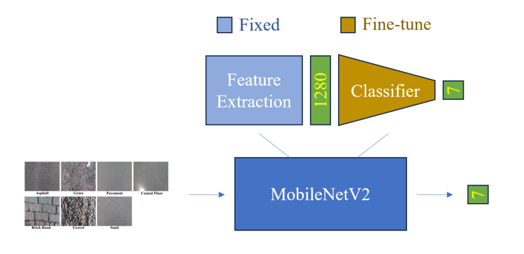
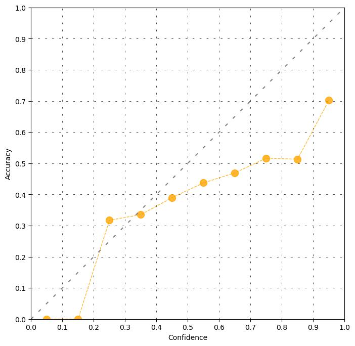
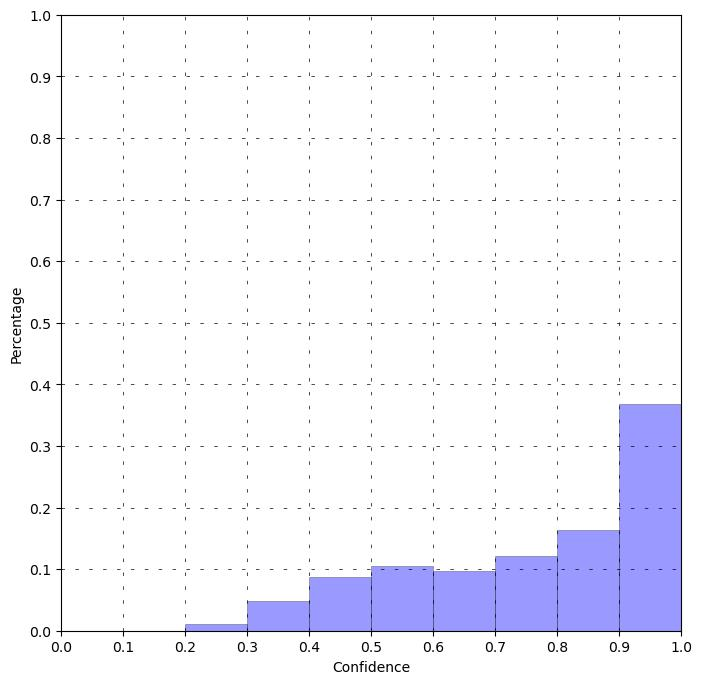
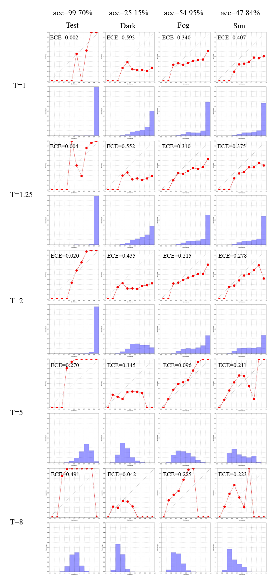

# A CNN Based Vision-Proprioception Fusion Method for Robust UGV Terrain Classification
A pytorch implementation of 2021 RAL paper [A CNN Based Vision-Proprioception Fusion Method for Robust UGV Terrain Classification](https://ieeexplore.ieee.org/abstract/document/9507312).

The dataset is downloaded from [open access](https://ieee-dataport.org/open-access/jackal-robot-7-class-terrain-dataset-vision-and-proprioception-sensors).

## Accuracy
### Image Net Part 
Architecture:


After training 5 epochs on trainSet_c7_corrected.hdf5,

| Experiment | Backbone | Testset | Dark | Sim_fog | Sim_sun |
| :-: | :-----------: | :------: | :------: | :------: | :------: |
| 1 | MobileNetV2 | **99.63%** | 53.27% | 68.98% | 65.72% | 
| 2 | MobileNetV2 | **99.93%** | 21.22% | 26.57% | 37.59% | 
| 3 | MobileNetV2 | **99.70%** | 25.15% | 54.95% | 47.84% | 


### Confidence Output
Reliability diagrams look like:

<p align="center">
 
</p>

**ECE** (**E**xpected **C**alibration **E**rror) on different sets:
```
temperature: 1
On test set: ECE: 0.002
On dark set: ECE: 0.593
On fog set: ECE: 0.340
On sun set: ECE: 0.407
temperature: 1.25
On test set: ECE: 0.004
On dark set: ECE: 0.552
On fog set: ECE: 0.310
On sun set: ECE: 0.375
temperature: 2
On test set: ECE: 0.020
On dark set: ECE: 0.435
On fog set: ECE: 0.215
On sun set: ECE: 0.278
temperature: 5
On test set: ECE: 0.270
On dark set: ECE: 0.145
On fog set: ECE: 0.096
On sun set: ECE: 0.211
temperature: 8
On test set: ECE: 0.491
On dark set: ECE: 0.042
On fog set: ECE: 0.225
On sun set: ECE: 0.223
```

Set T as fixed number 1, 1.25, 2, 5, 8, the outputs are reorganized as below:

## Usage
### Train Image Net
1. Prepare data. Please download from [ieee](https://ieee-dataport.org/open-access/jackal-robot-7-class-terrain-dataset-vision-and-proprioception-sensors).

Data folder then looks like below:
```
./
├── 
├── ...
└── data_folder/
    ├── darkSet_c7_ver_2.hdf5
    ├── sim_fog_ver_2.hdf5
    ├── sim_sun_ver_2.hdf5
    ├── testSet_c7_ver_2.hdf5
    ├── trainSet_c7_corrected.hdf5
    ├── validSet_c7_corrected.hdf5
    └── checkHDF5.ipynb
```

2. Requirements 

The required libraries are quite common, just install.
- Pytorch (1.10.0+cu113 better)
- Torchvision (0.11.1+cu113 better)
- h5py (3.6.0 better)
- matplotlib
- numpy

3. Create two folders to save outputs

Project folder looks like below:
```
├── project_folder/
    ├── model/
        └── ...
    ├── reliability_diagrams/
        └── ...
    ├── train.py
    ├── ...
    └── readme.md
```

4. Train network

Revise datapath in train.py, then:
```
python train.py
```
Then you can revise the modelpath and data path in eval.py, then:
```
python eval.py
```

5. Confidence calculation

The temperature scaling code is partly based on [temperature_scaling](https://github.com/gpleiss/temperature_scaling).

If you want to set temperature of logits (before softmax), you can designate in confidence_cal.py, then revise the input and output paths in confidence_cal.py, simply run:
```
python confidence_cal.py
```